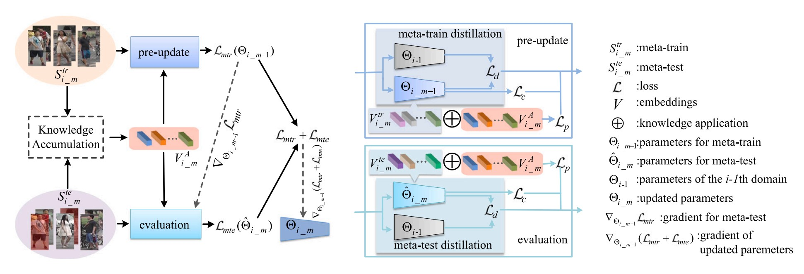
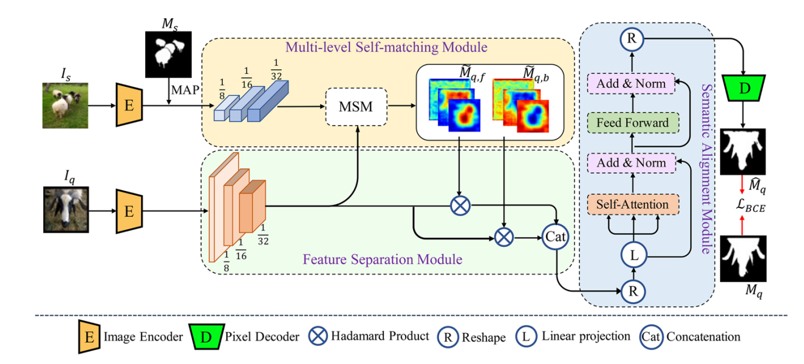
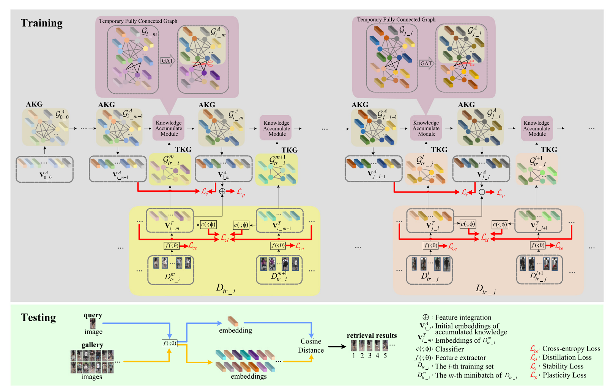








# About me 
I am currently a third year Ph.D. student at School of Computer Science and Engineering (Northeastern University, China). Fortunately, I've received the funding from the China Scholarship Council (CSC) to become a visiting Ph.D. at College of Computing and Data Science (Nanyang Technological University, Singapore).

My research interests include but not limited to computer vision, person re-identification, continual learning, and domain generalization.

# News
- *2024.07*: &nbsp;🔥New Journal Paper on Generalized Continual Person Re-identification via Meta learning and Knowledge Accumulation Accepted by Neural Networks 2024.
- *2024.05*: &nbsp;🎉New Journal Paper on Learning Discriminative Foreground-and-background Features for Few-shot Segmentation by Multimedia Tools and Applications 2024.
- *2023.04*: &nbsp;🎉New Journal Paper on Knowledge-Preserving Continual Person Re-identification using Graph Attention Network Accepted by Neural Networks 2023.

# Publications
 | [Generalized Continual Person Re-identification via Meta learning and Knowledge Accumulation](https://www.sciencedirect.com/science/article/abs/pii/S0893608024004854) 
**Zhaoshuo Liu**, Chaolu Feng*, Kun Yu, Jun Hu, Jinzhu Yang | [**Code**](https://github.com/DFLAG-NEU/GCReID) 
  

 | [Learning Discriminative Foreground-and-Background Features for Few-shot Segmentation](https://link.springer.com/article/10.1007/s11042-023-17708-5) 
Cong Jiang, Yange Zhou, **Zhaoshuo Liu**, Chaolu Feng*, Wei Li, Jinzhu Yang  | [**Code**](https://github.com/DFLAG-NEU/DFBNet) 
  

 | [Knowledge-Preserving continual person re-identification using Graph Attention Network](https://www.sciencedirect.com/science/article/abs/pii/S089360802300045X)  
**Zhaoshuo Liu**, Chaolu Feng*, Shuaizheng Chen, Jun Hu  | [**Code**](https://github.com/DFLAG-NEU/ContinualReID) 
  

# Educations 
- *2022.09 - now*, PhD candidate of School of Computer Science and Engineering, Northeastern University, Shenyang, China
- *2019.09 - 2022.07*, Master of School of Computer Science and Engineering, Northeastern University, Shenyang, China
- *2015.09 - 2019.07*, Bachelor of School of Data Science and Technology, North University of China, Taiyuan, China